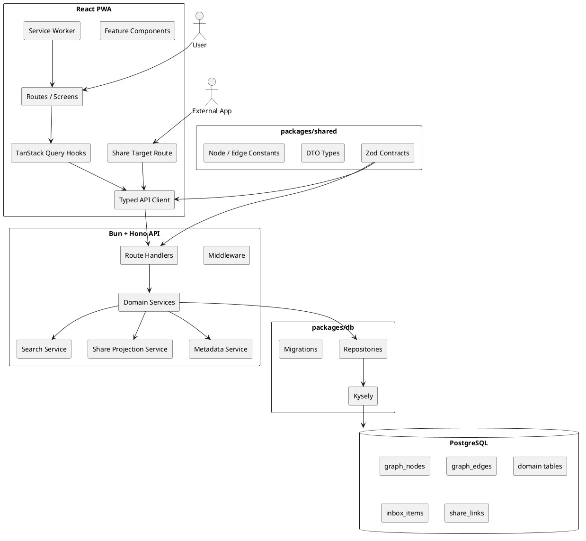
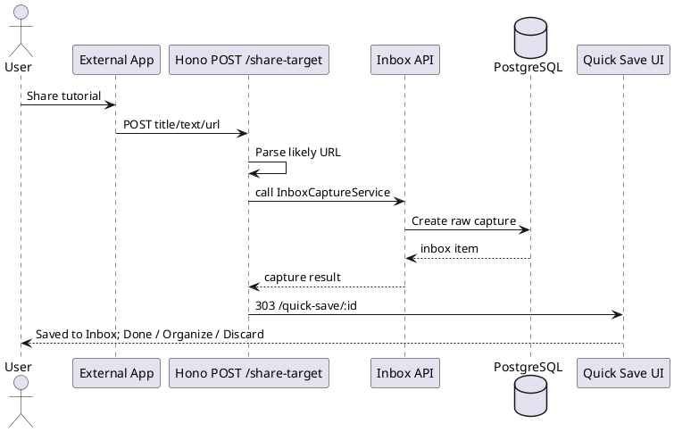

# Table Tennis Learning Library — Technical Design

> Architecture revision: 2.1  
> Reviewed: 2026-07-04  
> Status: canonical architecture document for MVP implementation

## 1. Purpose and Authority

This document defines the implementation architecture for **Table Tennis Learning Library**, a mobile-first Progressive Web App that turns scattered table-tennis tutorial videos into an organized, annotated, shareable learning graph.

Document ownership is intentionally separated:

- `PRD.md` owns product scope and requirements.
- `TECH.md` owns architecture, component boundaries, transaction boundaries, security, deployment, and technology decisions.
- `DATA_MODEL.md` owns exact persistent schema and source-of-truth rules.
- `API_CONTRACT.md` owns HTTP endpoint behavior and DTO shapes.
- `PRODUCT_DESIGN.md` and `UX_FLOWS.md` own user-facing behavior.
- `IMPLEMENTATION_PLAN.md` and `TASKS.md` own delivery order.
- `AGENTS.md` owns coding-agent operating rules.

Do not duplicate detailed schemas or complete endpoint contracts here. Where this document conflicts with the more specific contract documents, follow the precedence in `AGENTS.md` and fix the conflict rather than silently choosing a direction.

## 2. Architectural Invariants

The following are non-negotiable for MVP:

1. **Graph-backed from the first migration.**
   - First-class knowledge objects have a `graph_nodes` row and a domain row where domain-specific fields exist.
   - Meaningful cross-object relationships use typed `graph_edges`.
   - A graph database is not required; PostgreSQL stores the graph.

2. **Capture first, organize later.**
   - Native PWA share capture and manual URL paste are first-class flows.
   - Raw captures land in `inbox_items`.
   - Inbox conversion to a video is transactional and idempotent.

3. **Private by default.**
   - Hosted deployments require authentication for private data.
   - Public/unlisted links are created only by explicit user action.
   - Public rendering uses a dedicated projection service and never exposes arbitrary private graph traversal.

4. **Mobile first.**
   - Core capture, Inbox, library, notes, skills, search, and sharing flows must work on a phone.
   - The implementation must respect the product mobile interaction contract: narrow reflow, safe-area insets, software keyboards, touch hit areas, orientation, and non-obscured sticky actions.

5. **PostgreSQL is the database.**
   - SQLite support has been deprecated; the app uses PostgreSQL only (local via docker-compose, hosted via Supabase with the API/web on Render).
   - Migrations and repositories are PostgreSQL-targeted; no SQLite-only semantics remain.

6. **No hidden dual sources of truth.**
   - `DATA_MODEL.md` defines which field/table is authoritative when a relationship is mirrored for graph traversal.

## 3. Context Architecture



## 4. Technology Baseline

The baseline below was reviewed on 2026-07-04. `bun.lock` is the reproducible source of exact resolved versions after scaffolding. Upgrades require the quality gates in this document.

| Area | Decision | Reviewed baseline |
|---|---|---|
| Runtime/package manager/test runner | Bun | 1.3.14 |
| Frontend | React | 19.2 |
| Build tool | Vite | 8.1 |
| Language | TypeScript | pin exact compatible release in lockfile |
| Styling | Tailwind CSS | 4.3 |
| Components | shadcn/ui | React 19 + Tailwind 4 compatible generated components |
| Server state | TanStack Query | v5 |
| Forms | React Hook Form | 7.76.1 |
| Validation/contracts | Zod | v4 |
| API framework | Hono | 4.12.27 or newer reviewed security-patched release in same line |
| Query builder | Kysely | 0.29.2 |
| PostgreSQL driver | `pg` | Node `pg` Pool, SSL via `sslmode=require` |
| PWA integration | `vite-plugin-pwa` | 1.3.0 |
| Icons | `lucide-react` | exact patch pinned |
| Dates | `date-fns` | exact patch pinned |

### 4.1 PostgreSQL Driver Decision

The app uses PostgreSQL only, via the `pg` driver and Kysely's `PostgresDialect` with a connection pool:

```text
Bun runtime
  -> Kysely
  -> Kysely built-in PostgresDialect
  -> pg Pool
  -> PostgreSQL
```

`DATABASE_URL` must be a `postgres://` / `postgresql://` connection string. Hosted connections use TLS with the provider CA supplied through `DATABASE_CA_CERT`. Keep driver and pool configuration isolated in `packages/db`; do not leak `pg` APIs into repositories or services.

Local development uses the docker-compose Postgres instance (`bun run db:up`, host port 5433, database `tt_learning`, owner `ttlearn`). Tests reset a `tt_test` schema inside that database for isolation.

Example:

```ts
import { Kysely, PostgresDialect } from 'kysely'
import { Pool } from 'pg'
import type { Database } from './schema'

const pool = new Pool({ connectionString: process.env.DATABASE_URL!, max: 5 })
export const db = new Kysely<Database>({ dialect: new PostgresDialect({ pool }) })
```

A runtime smoke test must prove connectivity and migration from empty under the pinned versions before the DB milestone is accepted.

## 5. Repository Structure

Use one persistence implementation location. Repositories must not be duplicated between `apps/api` and `packages/db`.

```text
tt-learning-library/
  apps/
    web/
      src/
        app/
        routes/
        features/
        components/
        lib/
          api/
          pwa/
      public/
    api/
      src/
        index.ts
        middleware/
        routes/
        services/
        presenters/
        auth/
  packages/
    shared/
      src/
        contracts/
        dto/
        validators/
        constants/
    db/
      src/
        database/
        schema/
        migrations/
        repositories/
        testing/
  docs/
    PRD.md
    TECH.md
    DATA_MODEL.md
    API_CONTRACT.md
    PRODUCT_DESIGN.md
    UX_FLOWS.md
    IMPLEMENTATION_PLAN.md
    TASKS.md
    AGENTS.md
  package.json
  bun.lock
  tsconfig.base.json
```

Dependency direction:

```text
apps/web -> packages/shared
apps/api -> packages/shared + packages/db
packages/db -> packages/shared constants only where safe
packages/shared -> no app package
```

Avoid circular workspace dependencies.

## 6. Frontend Architecture

### 6.1 Routes

Canonical MVP routes:

```text
/                              Home
/sign-in                       Hosted sign-in entry
/session-expired               Recoverable hosted-session state when a dedicated route is useful
/inbox                         Inbox
/inbox/:inboxItemId            Organize capture
/quick-save/:inboxItemId       Native share receipt / Quick Save
/share-target                  same-origin Hono POST receiver; GET app-shell fallback for testing
/library                       Library
/videos/new                    Manual Add Video
/videos/:videoId               Video detail
/topics                        Topic list
/topics/:topicId               Topic detail
/skills                        Skill list
/skills/:skillId               Skill detail
/notes/:noteId                 Note detail/edit
/mistakes/:mistakeId           Mistake detail/edit
/drills                        Drill list
/drills/:drillId               Drill detail
/search                        Global search
/paths                         Learning paths, late MVP
/paths/:pathId                 Learning path detail, late MVP
/settings                      Settings
/s/:shareToken                 Read-only shared view
```

Collections are post-MVP and therefore have no canonical MVP route.

### 6.2 State Rules

Use:

- TanStack Query v5 for server state.
- React local state for transient UI state.
- React Hook Form + Zod for forms.
- URL search params for user-visible filters and GET compatibility testing only; production native share POST payloads are not copied into URLs.
- A small UI store only when truly global transient state is required.
- Local draft preservation for session-expired recovery on keyboard-heavy forms.

Do not duplicate API data into a client store. Back navigation should restore query/filter state and practical list scroll context.

### 6.3 Typed API Client

The API client must parse response envelopes and runtime-validate external boundaries.

Do not use unchecked generic casts such as:

```ts
return res.json() as Promise<T>
```

Use shared schemas:

```ts
export async function apiRequest<T>(
  input: RequestInfo | URL,
  init: RequestInit | undefined,
  schema: z.ZodType<T>,
): Promise<T> {
  const response = await fetch(input, init)
  const payload: unknown = await response.json()

  if (!response.ok) {
    const error = ApiErrorResponseSchema.safeParse(payload)
    throw new ApiClientError(response.status, error.success ? error.data.error : undefined)
  }

  return schema.parse(payload)
}
```

### 6.4 PWA Update UX

Use a **prompted service-worker update** so the user chooses when the app reloads.

Rules:

- `Update now` activates the worker immediately and may discard in-progress form edits;
- `Later` keeps the current session usable;
- update availability is announced without blocking capture;
- the update prompt makes the reload action explicit.

### 6.5 Mobile UI Implementation Constraints

The exact visual system is owned by `PRODUCT_DESIGN.md`; implementation must preserve these constraints:

- layout passes at 320 CSS px without critical horizontal page scrolling;
- primary phone target is 360–390 CSS px;
- bottom navigation and sticky actions include safe-area inset handling;
- content reserves space so sticky/floating controls do not cover the final item;
- keyboard-heavy screens keep focused fields and primary actions visible;
- critical interactive hit containers are at least 44 × 44 CSS px;
- primary buttons generally use at least 48 CSS px height;
- no non-essential flow requires portrait or landscape;
- sheets/dialogs manage focus and restore it on close;
- list/detail navigation restores practical query/filter/scroll context;
- long lists use deterministic incremental pagination with an accessible explicit load-more path.

## 7. PWA and Share Capture Architecture

### 7.1 Manifest

The manifest must include installability metadata and a share target.

Recommended capture transport:

```json
{
  "share_target": {
    "action": "/share-target",
    "method": "POST",
    "enctype": "application/x-www-form-urlencoded",
    "params": {
      "title": "title",
      "text": "text",
      "url": "url"
    }
  }
}
```

Production native share capture uses a same-origin **Hono POST handler** at `/share-target`. A Vite SPA client route alone cannot reliably receive a navigation POST on static hosting. The server handler parses the bounded form payload, creates the durable Inbox item through the same domain service used by `/api/inbox`, and returns a `303` redirect to `/quick-save/:inboxItemId`.

This is a durable Inbox-first flow. By the time `/quick-save/:inboxItemId` renders, the Inbox item already exists. The UI must therefore show `Saved to Inbox` and offer `Done`, `Organize Now`, or explicit `Discard Capture`; it must not show an ambiguous `Save to Inbox` action.

Manual `/share-target?title=...&text=...&url=...` GET handling may remain for browser testing and compatibility, but production native share capture should prefer POST so shared text is not unnecessarily transported in the URL.

### 7.2 Capture Flow



The Hono receiver uses the same `InboxCaptureService` as the JSON Inbox API; it must not duplicate capture business logic. If hosted authentication is required and the share POST has no valid session:

- do not persist an ownerless private capture;
- redirect to a safe sign-in/recovery flow;
- preserve only bounded continuation context that is safe for the selected auth mechanism;
- never place raw shared text into an unbounded URL;
- after authentication, resume a safe capture step or offer manual paste.

The product does not promise automatic replay of an unauthenticated navigation POST unless the implementation can do so safely and explicitly.

The capture parser checks, in order:

1. explicit `url`;
2. URLs extracted from `text`;
3. combined payload;
4. editable manual input when no valid URL is found.

Store raw payload for future parser improvements. Apply request-size limits.

### 7.3 Service Worker Cache Policy

MVP policy:

```text
Hashed JS/CSS/assets     CacheFirst
App shell                StaleWhileRevalidate
Navigation               NetworkFirst + offline shell fallback
/api/* private           NetworkOnly
/api/public/share/*      NetworkFirst initially
Private JSON             never precache
Share-target POST        never cache
```

Do not implement offline mutation queues in MVP. Private offline reading is also not a product promise because private API JSON is `NetworkOnly`; an already-rendered in-memory screen may remain visible, but new private navigation must show an honest offline-unavailable state.

## 8. Backend Architecture

### 8.1 Request Pipeline

Recommended order:

```text
request id
-> structured request logging
-> secure headers
-> body-size limit
-> timeout
-> CORS/CSRF policy as applicable
-> authentication
-> route-level validation
-> route handler
-> domain service
-> repository
-> error mapping
```

### 8.2 Layer Responsibilities

**Route handler**
- Parse path/query/body.
- Validate with shared Zod schemas.
- Read current principal.
- Call one service operation.
- Map service result to DTO.

**Domain service**
- Own business rules.
- Own transaction boundaries.
- Enforce ownership and lifecycle invariants.
- Coordinate repositories.

**Repository**
- Own Kysely queries.
- Apply default `deleted_at IS NULL` filters unless explicitly querying tombstones.
- Never decide product workflow.

**Presenter/projection**
- Convert domain results to stable API DTOs.
- Public share projections must use a dedicated path.

## 9. Transaction Boundaries

Any operation that creates or mutates a first-class graph-backed object must be atomic.

### 9.1 Inbox Conversion

Canonical service:

```text
convertInboxItemToVideo(inboxId, input, currentUser)
```

Algorithm:

```text
1. Begin transaction.
2. Load Inbox item scoped to owner.
3. If converted_node_id is set:
     return the existing conversion.
4. Validate and canonicalize source URL.
5. Detect source platform and external ID.
6. Check duplicate identity for this owner.
7. Create graph_nodes row for video.
8. Create videos row referencing node_id.
9. Resolve selected topic/skill/tag IDs to owner-visible nodes.
10. Create validated graph edges.
11. Create optional note in the same transaction.
12. Mark Inbox item organized.
13. Set converted_node_id.
14. Commit.
15. Return node + video + created edges.
```

All failures before commit roll back.

### 9.2 Other Atomic Operations

Apply the same principle to:

- create/update/delete video;
- create skill and primary-topic relationship;
- create topic hierarchy;
- create note and attachment;
- create drill and links;
- add/reorder/remove learning-path item;
- create/revoke share link.

## 10. Data Architecture

The exact schema is in `DATA_MODEL.md`.

Minimum base set:

```text
users                     hosted-mode identity
graph_nodes               first-class knowledge objects
graph_edges               typed graph relationships

videos
topics
skills
notes
drills
mistakes
tags
learning_paths
learning_path_items
creators
sources

inbox_items               pre-graph capture workflow
share_links               explicit read-only sharing
```

### 10.1 Source-of-Truth Rule

Use this rule everywhere:

```text
Domain tables:
  authoritative for domain-specific fields, including separate Video progress and Video learning state plus Skill/Drill status.

graph_nodes:
  authoritative for universal graph identity, node type,
  display title/summary, visibility, and lifecycle timestamps.

graph_edges:
  authoritative for semantic cross-object relationships,
  except where DATA_MODEL.md explicitly defines an ordered/stateful
  membership table as authoritative.
  Allowed pairs come from the centralized table-tennis ontology;
  arbitrary user-authored edge types and node pairs are unsupported.

Specialized membership tables:
  authoritative where relationship state/order cannot be represented
  safely by a bare edge.
```

Mirrors are updated in the same transaction.

### 10.2 IDs and Time

- Text IDs with stable prefixes.
- Recommended generator: UUIDv7 encoded as text with a readable type prefix.
- UTC ISO 8601 strings stored as text in PostgreSQL.
- PostgreSQL migration target: `timestamptz`.
- Never mix epoch milliseconds and ISO strings in new tables.

### 10.3 Soft Deletion

First-class knowledge objects use soft deletion:

```text
graph_nodes.deleted_at
domain_table.deleted_at
graph_edges.deleted_at
```

Delete service behavior:

1. verify owner;
2. set domain `deleted_at`;
3. set node `deleted_at`;
4. tombstone affected edges as required;
5. revoke active share links to the deleted node;
6. commit atomically.

Hard deletion is a separate purge operation, not a normal API delete.

## 11. URL Identity and Metadata

### 11.1 Safe Platform Detection

Never use substring matching such as:

```ts
host.includes('youtube.com')
```

Use domain boundaries:

```ts
function isHost(hostname: string, domain: string): boolean {
  return hostname === domain || hostname.endsWith(`.${domain}`)
}
```

### 11.2 Canonicalization

Canonicalization must:

- parse with the platform URL parser;
- lowercase host;
- remove default ports;
- remove tracking parameters;
- extract stable provider external ID where supported;
- preserve original `source_url`;
- write normalized `canonical_url`.

Known-provider identity:

```text
(user_id, source_platform, external_id)
```

Generic fallback:

```text
(user_id, canonical_url)
```

Canonical product behavior for an exact duplicate is:

```text
do not create another Video
-> return existing identity in a typed result
-> UI shows "Already in your library"
-> primary action opens existing Video
```

Additional rules:

- YouTube capture metadata uses the fixed `https://www.youtube.com/oembed` endpoint; callers cannot control the remote host.
- Fetches occur after durable Inbox creation, use a short timeout and bounded response, reject redirects, and validate returned thumbnail hosts.
- Keyless enrichment populates title, creator, and thumbnail only; metadata failure never prevents capture or conversion.
- Inbox conversion retry with `converted_node_id` is idempotent and is not treated as a user-visible new duplicate;
- a raw Inbox capture may remain only when it contains useful unsaved context and the user explicitly chooses to keep it;
- MVP does not block fuzzy or semantic near-duplicates;
- API contracts should distinguish `EXISTING_OBJECT` from validation errors and transaction retries.

### 11.3 Metadata Extraction Security

Metadata extraction is optional and failure-tolerant.

If the server fetches remote URLs:

- allow only `http` and `https`;
- resolve and block loopback, private, link-local, and otherwise disallowed network destinations;
- re-check redirect destinations;
- cap redirect count;
- apply connect/read timeout;
- cap response bytes;
- accept only expected content types;
- never send internal credentials;
- log provider and outcome, not sensitive payloads.

## 12. Search Architecture

Define a replaceable interface:

```ts
interface SearchProvider {
  search(input: {
    userId: string
    q: string
    nodeType?: GraphNodeType
    videoProgress?: 'saved' | 'watching' | 'watched'
    videoLearningState?: 'none' | 'practicing' | 'revisit' | 'understood'
    skillStatus?: 'not_started' | 'learning' | 'practicing' | 'improving' | 'comfortable'
    limit: number
    offset: number
  }): Promise<SearchResult[]>
}
```

MVP implementation:

- SQL `LIKE` over selected normalized text fields.
- Search videos, skills, topics, note bodies, drills, and tags.
- Owner-scoped.
- Exclude deleted rows.
- Deterministic ordering.
- Escape wildcard characters.
- Cap pagination limits.

Later implementations may use PostgreSQL full-text search or vectors without changing route handlers.

## 13. Authentication and Deployment Modes

### 13.1 Local Private Mode

Allowed for local-only development and a private single-user build:

- no public internet exposure;
- no meaningful public sharing requirement;
- a seeded development principal may be used.

### 13.2 Hosted MVP Mode

Required for an internet-accessible deployment:

- authentication required;
- every private query scoped to current user;
- write requests protected according to the selected auth mechanism;
- explicit share links for read-only access.

Recommended first hosted architecture: same-origin PWA + API with secure, `HttpOnly`, `SameSite` cookies and an appropriate CSRF strategy for state-changing requests.

The selected hosted provider is Supabase Auth. The browser uses the publishable
key for passwordless email login and sends the short-lived user access token to
the same-origin Hono API. Hono validates the token with the Supabase Auth user
endpoint, derives ownership exclusively from the verified subject, and never
trusts caller-supplied user IDs. A secure `HttpOnly`, `SameSite=Lax` session
cookie supports native PWA share-target POST requests; ordinary JSON API calls
also send the bearer token. Unauthenticated share payloads are retained for at
most ten minutes in a signed, bounded, `HttpOnly` continuation cookie.

On Android, an email-link callback opened outside standalone display offers an
explicit same-origin link back to the installed PWA. The callback preserves the
Supabase auth response only in the URL fragment, so credentials are not sent in
HTTP requests, proxy logs, or referrer headers. The installed PWA remains
responsible for validating and persisting the Supabase session.

On iOS, where a Home Screen PWA cannot claim the HTTPS callback, the browser
offers a copy action for the same fragment-only handoff URL. The installed PWA
accepts a pasted handoff only from its own origin, requires both Supabase
session tokens, validates them through `setSession`, and clears the clipboard
on success when browser permissions allow. Raw tokens are never rendered as
visible text.

Session UX contract:

- protected API responses use a stable authentication error code;
- client preserves safe intended destination;
- keyboard-heavy form drafts remain locally present after an auth failure;
- retry occurs after reauthentication with explicit UX unless the operation is provably idempotent;
- sign-out clears private TanStack Query caches and other private client state;
- share-target POST without a valid hosted session never creates ownerless private data.

Hosted MVP product policy uses an adult account owner; junior-player use is parent/guardian-managed. Jurisdiction-specific legal/privacy review remains a release responsibility.

Do not expose a no-auth private-data API publicly.

## 14. Sharing Architecture

### 14.1 MVP Shareability Matrix

```text
Video          yes
Skill          yes
Drill          yes
Learning Path  late MVP, only when Paths ship
Topic          no
Note           no
Mistake        no as an independent target
Collection     no, post-MVP
```

The API must reject share-link creation for unsupported target types even if they are graph nodes.

### 14.2 Token Storage

Generate at least 256 bits of cryptographically random token material. Store a consistently encoded SHA-256 digest of that high-entropy token plus:

```text
token_hash
token_prefix
```

rather than the raw token. Return the raw token only when the link is created.

### 14.3 Share Projection Boundary

Public reads use:

```text
ShareProjectionService
```

Flow:

```text
presented token
-> hash
-> active/non-expired/non-revoked lookup
-> resolve target node
-> verify target not deleted
-> build allowlisted public DTO
-> include only safe related previews
-> return read-only projection
```

Never reuse a generic private graph traversal result for a public page. Each shareable target type has an explicit DTO schema and explicit related-preview allowlist; there is no generic `neighbors` field in a public DTO.

### 14.4 Revocation

Revocation must take effect immediately at the API layer. Deleted target nodes automatically invalidate public reads.

## 15. API Architecture

The canonical endpoint and DTO contract is `API_CONTRACT.md`.

Required API families:

```text
/api/health
/api/ready
/api/inbox
/api/videos
/api/topics
/api/skills
/api/notes
/api/mistakes
/api/drills
/api/graph
/api/search
/api/share-links
/api/public/share
/api/learning-paths
```

All errors use:

```json
{
  "error": {
    "code": "VALIDATION_ERROR",
    "message": "Human-readable message",
    "details": {}
  }
}
```

Do not expose stack traces or raw database errors.

## 16. Security Requirements

Minimum hosted-MVP controls:

- authentication and owner scoping;
- private-by-default visibility;
- explicit share link creation;
- token hashing and revocation;
- request body limits;
- request timeout;
- structured request IDs;
- secure headers and a Content Security Policy suitable for the deployed app;
- strict same-origin CORS by default;
- CSRF protection when cookie auth is used;
- output encoding and no unsafe HTML rendering of notes/metadata;
- remote-fetch SSRF controls;
- rate limits for public share reads and metadata extraction;
- secret management outside source control;
- no sensitive request bodies in logs;
- dependency security review before release.

Hono must remain on a reviewed security-patched release.

## 17. Database Operations

### 17.1 PostgreSQL Settings

Connections use a `pg` connection pool with TLS enabled for hosted connections. `DATABASE_CA_CERT` supplies the provider CA PEM so certificate and hostname verification remain enabled for Supabase. Foreign keys are enforced by PostgreSQL by default (no PRAGMA needed). Pool size is capped (default 5). `DATABASE_URL` is required and must be a `postgres://` / `postgresql://` connection string.

Local development uses the docker-compose Postgres instance (`bun run db:up`).

### 17.2 Migrations

Rules:

- explicit numbered migrations;
- no schema mutation at app startup except migration command in controlled deployment;
- migration from empty DB tested;
- upgrade from previous released schema tested;
- backup before production migration;
- irreversible migrations require explicit operator note.

### 17.3 Backup and Restore

Initial target:

```text
RPO: 24 hours
RTO: 4 hours
nightly database backup
7 daily copies
4 weekly copies
monthly restore test during beta
```

Back up PostgreSQL with `pg_dump` or managed-service snapshots (and point-in-time recovery where available). Do not assume file-copy backups are safe under load.

User export is not a substitute for server backup.

## 18. Observability and Operations

Required:

- `GET /api/health`: process health;
- `GET /api/ready`: DB connectivity and migration compatibility;
- request ID in logs and response header;
- structured JSON logs in production;
- migration version at startup;
- startup environment validation;
- graceful shutdown;
- disk-space monitoring where PostgreSQL is hosted;
- error reporting with redaction.

Do not log full share payloads, note bodies, auth cookies, or share tokens.

## 19. Testing Strategy

### 19.1 Unit Tests

- URL extraction and canonicalization;
- safe host matching;
- timestamp parsing;
- node/edge validation;
- share-token hashing;
- public projection field allowlist;
- Video progress and learning-state validation;
- difficulty enum validation.

### 19.2 Repository Tests

Run against the `tt_test` schema (reset per test) in the docker-compose PostgreSQL instance:

- migrations;
- foreign keys;
- soft-delete filters;
- owner scoping;
- graph traversal;
- duplicate identity constraints.

### 19.3 Service Integration Tests

Mandatory:

- graph node + domain row atomic creation;
- rollback on edge failure;
- Inbox conversion idempotency;
- duplicate conversion retry;
- exact duplicate returns existing identity without a second Video;
- session-expired retry behavior for idempotent versus non-idempotent operations;
- skill/topic mirror consistency;
- learning-path reorder transaction;
- delete + share revocation;
- revoked and expired share token behavior.

### 19.4 API Tests

- validation envelopes;
- pagination caps;
- authorization;
- not-found isolation across owners;
- public share projection privacy;
- unsupported share-target type rejection;
- sign-out/private-cache isolation behavior at the client boundary.

### 19.5 E2E Tests

Critical mobile flows:

```text
manual URL -> Inbox -> organize -> video detail
native share payload -> durable Inbox -> Saved to Inbox -> Done
native share payload -> durable Inbox -> Organize Now
native share payload -> Discard Capture
exact duplicate -> Already in your library -> Open Existing
session expires during edit -> sign in -> draft preserved -> retry
video -> timestamp note -> timestamp open
skill -> linked video/drill/mistake
search -> filter -> open result -> Back restores context
create share link -> public view -> revoke -> unavailable
PWA update available -> Later defers reload
```

Run the critical suite against a recorded phone matrix that includes:

```text
320 CSS px narrow-reflow target
360–390 CSS px primary phone target
412–430 CSS px large-phone target
software keyboard visible on keyboard-heavy flows
portrait and functional landscape
safe-area inset simulation or real-device coverage
```

For each release candidate, record exact OS version, browser version, install mode, and device/viewport for the tested combinations. Native receive-share capability is verified, not inferred.

## 20. Database Notes

The application is PostgreSQL-only. SQLite support has been deprecated. Keep migrations and repositories PostgreSQL-targeted and avoid dialect-specific behavior that would block future hosted-Postgres upgrades.

Review when changing schema:

- `TEXT` time values (kept as ISO 8601 strings) vs `timestamptz`;
- indexes and partial unique indexes;
- case-insensitive search behavior (`lower() like`);
- JSON fields (`*_json` columns stored as text);
- unique constraints.

Do not introduce database-specific application semantics without an abstraction and test.

## 21. Implementation Order

Use `IMPLEMENTATION_PLAN.md` as the canonical sequence.

Architecture-critical order:

```text
1. Scaffold and shared contracts
2. Kysely + PostgreSQL driver smoke test
3. graph_nodes + graph_edges
4. domain tables and source-of-truth invariants
5. URL parsing and Inbox
6. PWA installability + share target
7. Inbox conversion transaction
8. core library objects
9. search and related graph
10. explicit sharing projection
11. paths, late MVP
12. authentication/session recovery and mobile interaction hardening
13. backup, restore, accessibility, and acceptance tests
```

## 22. Non-Goals for MVP

Do not add:

- microservices;
- graph database;
- complex offline mutation sync;
- real-time collaboration;
- community feed;
- heavy AI summarization/transcription pipeline;
- vector database;
- payment system;
- advanced visual graph editor;
- collections of mixed learning objects.

## 23. Verification References

Technology choices were checked against official project documentation/releases during the 2026-07-04 architecture review:

- React versions: `https://react.dev/versions`
- Vite releases: `https://vite.dev/releases`
- Bun: `https://bun.sh/`
- Tailwind CSS releases: `https://tailwindcss.com/blog`
- shadcn Tailwind v4 guidance: `https://ui.shadcn.com/docs/tailwind-v4`
- Hono Bun support and releases: `https://hono.dev/docs/getting-started/bun`
- Kysely getting started: `https://kysely.dev/docs/getting-started`
- Zod 4: `https://zod.dev/v4`
- TanStack Query v5: `https://tanstack.com/query/v5/docs/framework/react/overview`
- Vite PWA: `https://vite-pwa-org.netlify.app/`
